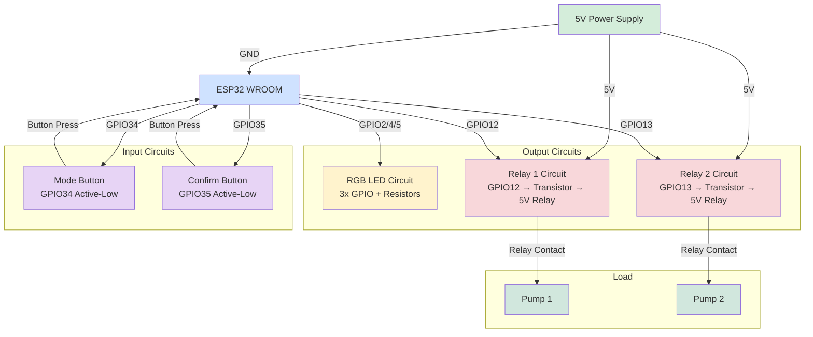
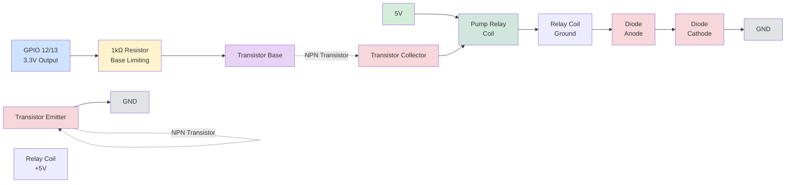
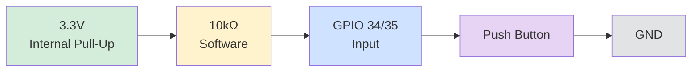
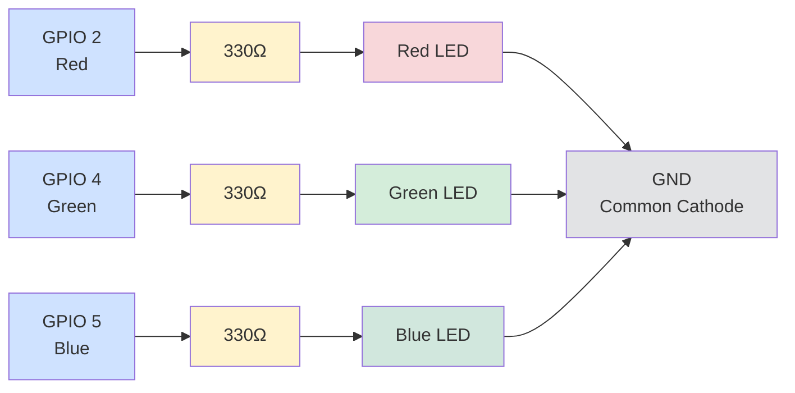
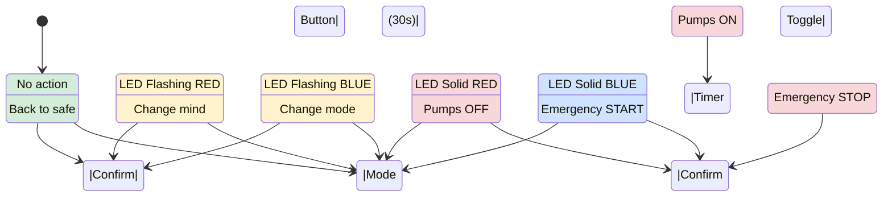
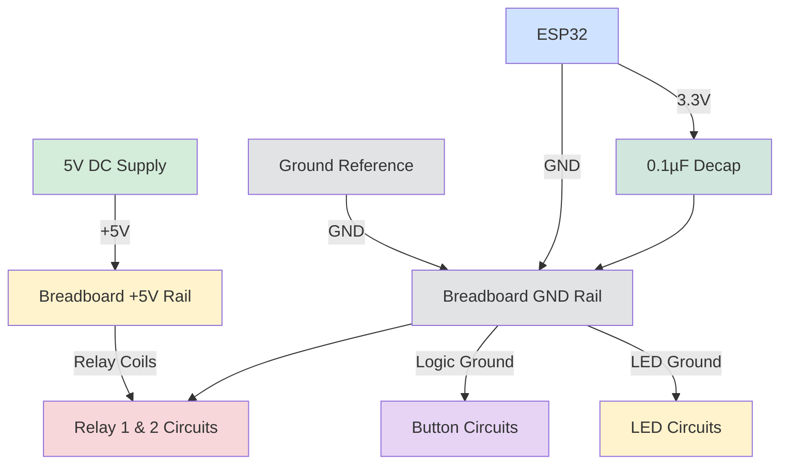
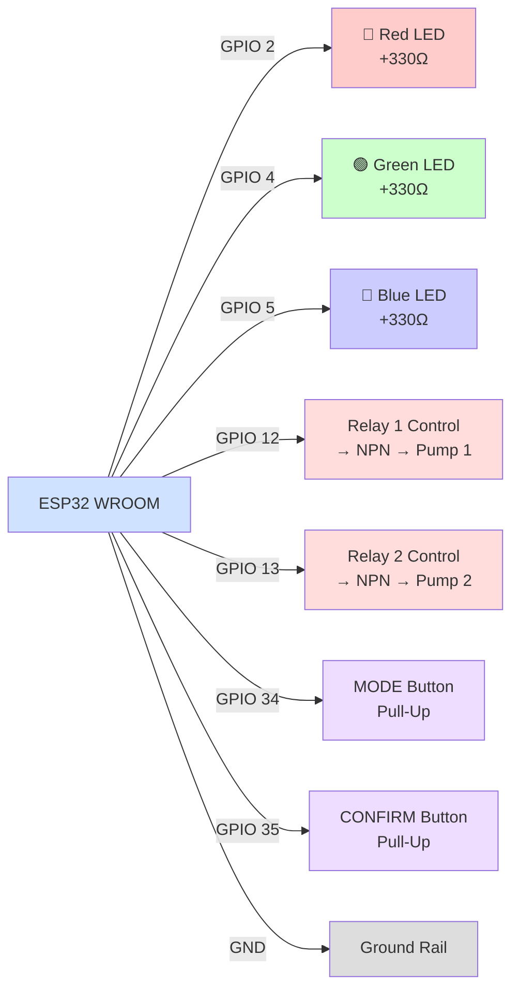

# Bio-Bubbler Circuit Diagrams (Visual Rendering Ready)

This file contains circuit diagrams that can be rendered visually.

## System Block Diagram

## Relay Control Circuit (Detailed)

## Button Input Circuit

## RGB LED Circuit

## State Machine (Software Logic)

## Breadboard Power Distribution

## Pin Assignment Summary

---

## Component Values at a Glance

| Component | Value | Purpose |
|-----------|-------|---------|
| LED Resistor | 330Ω | Current limiting for RGB LEDs (3.3V GPIO) |
| Transistor Base Resistor | 1kΩ | Base current limiting (3.3V GPIO → transistor) |
| Button Pull-Up | Internal | Software pull-up on GPIO 34/35 (no external needed) |
| Debounce Capacitor | 0.1µF (optional) | Hardware debounce on buttons |
| Decoupling Capacitor | 0.1µF | Power supply stability near ESP32 |
| Relay Coil Voltage | 5V DC | Standard relay operating voltage |
| Freewheeling Diode | 1N4007 | Relay transient protection |
| Transistor Type | NPN BJT (2N2222/BC547) | Relay driver (500mA capable) |

---

## Safety Margins

✓ **GPIO Current:** Each GPIO pin rated 40mA max
  - RGB LED at 330Ω: ~4mA each, well within limits
  - Transistor base at 1kΩ: ~3.3mA, within limits

✓ **Transistor Rating:** BC547/2N2222 rated 500mA collector current
  - Typical relay coil: 50-100mA, very safe margin

✓ **Button Inputs:** GPIO 34/35 with internal pull-ups
  - Safe for momentary button presses
  - No external pull-up needed

✓ **Diode Rating:** 1N4007 rated 1A
  - Relay coil collapse current: <500mA, very safe margin

✓ **Power Distribution:** Shared GND between ESP32 and 5V supply
  - Prevents noise and ensures proper logic levels

