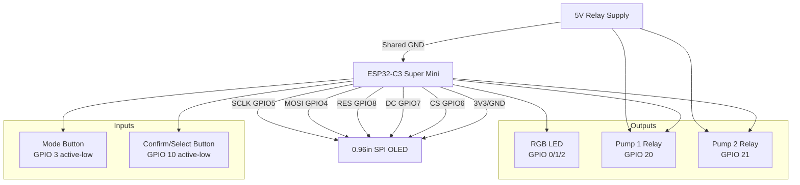
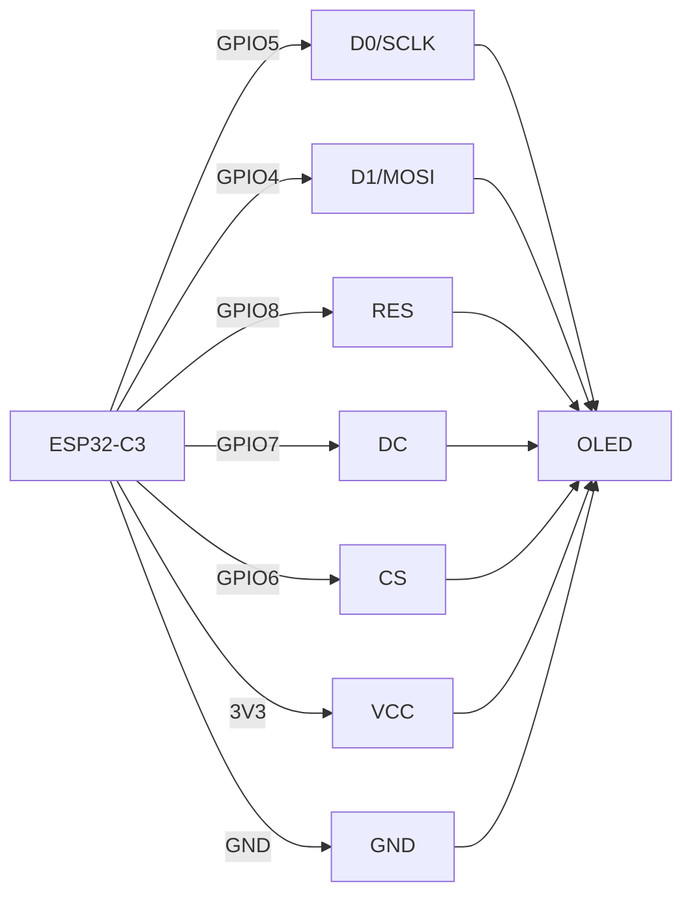
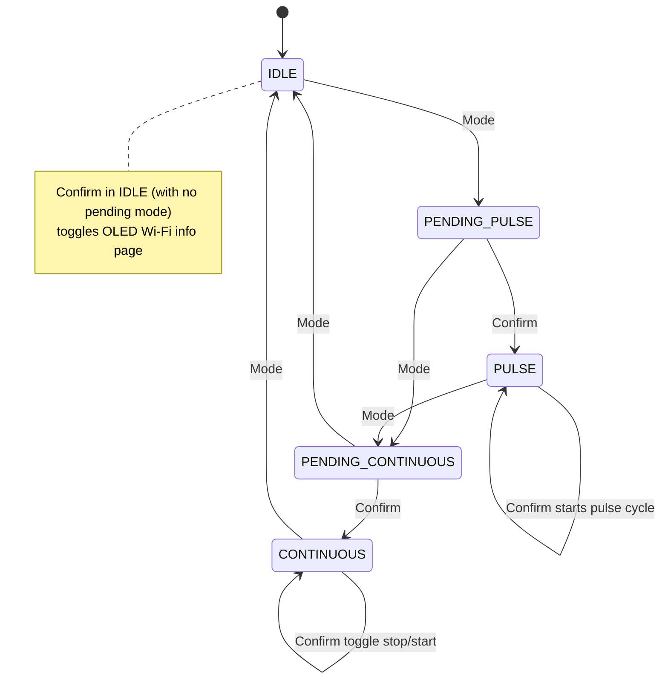
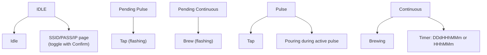

# Bio-Bubbler Circuit Diagrams (Visual Rendering Ready)

This file contains Mermaid diagrams aligned with the current firmware.

## System Block Diagram

## OLED SPI Wiring

## State Machine (Current Behavior)

## OLED UI Mapping

## Component Values

| Item | Value/Type |
|---|---|
| LED resistors | 330 ohm |
| Relay base resistors | 1k ohm |
| Relay transistor | NPN (2N2222 / 2N3904 / BC547) |
| Relay flyback diode | 1N4007 |
| Button wiring | GPIO to GND, internal pull-up |
| OLED interface | SPI (D0, D1, RES, DC, CS) |
